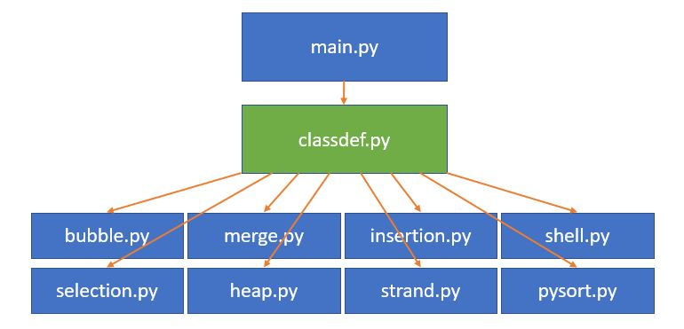

# Analyzing Big Data Sorting Algorithms :hand: fa18-523-63

| Mark Miller 
| mgm3@indiana.edu 
| Indiana University 
| hid: fa18-523-63 
| github: [:cloud:](https://github.com/cloudmesh-community/fa18-523-63/edit/master/project-report/report.md) 
| code: [:cloud:](https://github.com/cloudmesh-community/fa18-523-63/tree/master/project-code)


Keywords: Sorting Algorithms, Python, Big Data Sorting, Computational Efficiency


## Abstract

There are many different sorting algorithms that vary vastly in terms of 
efficiency, memory usage (depending on the programming language), and time to
 completion. It is simply not effective to identify a specific data point and
find it's place in comparison to the rest of the data. There are many methods
in place to help computational efficiency when needing to get data sorted
quickly and in a light-weight fashion. The purpose of this project is to provide
code for many commonly used sorting algorithms while analyzing their efficiency.
This depends highly on the way that the data stored, the initialization of the
data, and the computational power inherent to the machine which is performing 
the operations. We will restrict to identical machine specifics and reset
memory usage after each algorithm to ensure balanced and stable results. Not all
popular sorting algorithms are used in this project, but many are. A simple
timing mechanism, inherent to the programming language in use will be used to
time each operation that is performed.

## Introduction

There are many mathematical principles that contribute to efficient computing. 
There is a common problem, as defined by *Pointless Programming*
[@www-fa18-523-63-two-light-bulbs], which presents the following scenario:

> "You have two light bulbs and 100 story building. You must determine the
> minimal floor such that if you drop the light bulb from that floor it breaks.
> Once you break a bulb, it can’t be reused.
> Question: What’s the smallest number of drops required in the WORST case to 
> determine the minimal floor." [@www-fa18-523-63-two-light-bulbs]

Assuming that no damage is done to the light bulb after prelimary drops, 
one method to this approach is to start at the bottom floor and increment the
floor until the light bulb breaks. This way, the answer is obtained with just
one lightbulb but it takes a long time to climb the stairs and drop the bulb
from each individual floor, especially if the lightbulb can resist 99 floors of
drops. 

Another method is to begin from the fiftieth floor. This way, half
of the floors will be removed at once.

The mathematical answer benefits from the "square root law" 
[@www-fa18-523-63-square-root]. Finding the square root of the length of the
 data, 
(ten, in this case), provides the segmentation required to specify that it can
take no more than 19 drops in order to determine the number of floors which can
be endured for the light bulb.

Similar principles can be used in determing optimal methods for sorting big data
algorithms. While not as simple as the problem described above, there are many
algorithms that vary in efficiency that will be analyzed in this project. These
algorithms include the following: Bubble sort [@www-fa18-523-63-bubble-sort], 
Merge sort [@www-fa18-523-63-merge-sort], Insertion sort 
[@www-fa18-523-63-insertion-sort], 
Shell sort[@www-fa18-523-63-bubble-sort], Selection sort 
[@www-fa18-523-63-insertion-sort], Square Root sort (self-developed), Strand 
sort [@www-fa18-523-63-strand-sort], Python's sorting algorithm,
[@www-fa18-523-63-python-sort], and Heap sort [@www-fa18-523-63-heap-sort]. 

Many companies that utilize large datasets, do this through various Structured 
Query Language (SQL) databases [@www-fa18-523-63-sql]. These can contain far 
more rows and columns then other, more user-friendly software, like Microsoft 
Excel, can, by millions of rows and columns [@www-fa18-523-63-mysql-limitations]
[@www-fa18-523-63-excel-limitations]. This project is related to big data 
because in most algorithms, time complexity and operational complexity is more
than most computer resources are able to handle for the tasks that are given to 
them. Big data often needed to be sorted, which causes problems for many database administrators, programmers, data scientists, and more. 


## Requirements

Due to the random number generation of a ten-million numbers, it is recommended
that these steps be completed on a compute system with at least 16 GB of RAM.
 Python 3.6 or higher.

Here is a summary of the hardware and software requirements of this project:
* 16 GB of RAM (Due to the generation of 10 million random numbers)
* Intel(R) Core(TM) i5-4690K CPU  @ 3.50GHz (This level of CPU is sufficient)
* Python 3.6 [@www-fa18-523-63-python-36] or higher (Performed using the Spyder
 IDE [@www-fa18-523-63-spyder])
* Package Inclusion:
  * Python Random [@www-fa18-523-63-python-random]
  * Python Time [@www-fa18-523-63-python-time]
  * Python Standard Library [@www-fa18-523-63-python-std]
  * TBD

## Design
Contained in this section is a description of each of the sorting algorithms
that are used along with `pseudocode` of the algorithms.

### Bubble Sort

![Bubble Sort[@www-fa18-523-63-bubble-wiki]](images/bubble_sort.JPG){#fig:bubblesort}

The Bubble sort algorithm is known to be one of the slower algorithms 
[@www-fa18-523-63-bubble-sort]. The
basic process takes two adjacent data points and if they are in the wrong order
it will simply change the order of the two pairs. This is computationally
expensive and requires considerable time to compare each individual element to 
all other elements in the list. At worst case scenario, the amount of operations
requred are at the order of the number of elements in the list squared 
[@www-fa18-523-63-intro-to-algorithms]. 

Pseudo-code [@www-fa18-523-63-bubble-wiki]:

```
procedure bubbleSort( A : list of sortable items )
    n = length(A)
    repeat
        swapped = false
        for i = 1 to n-1 inclusive do
            /* if this pair is out of order */
            if A[i-1] > A[i] then
                /* swap them and remember something changed */
                swap( A[i-1], A[i] )
                swapped = true
            end if
        end for
    until not swapped
end procedure
```

### Merge Sort
![Merge Sort[@www-fa18-523-63-merge-sort-wiki]](images/Mergesort.JPG){#fig:mergesort}

The Merge sort algorithm is a vast improvement on the bubble sort algorithm.
It was originally developed by the popular mathematician and computer scientist
John von Neumann [@www-fa18-523-63-knuth]. This method segments the data
intelligently and sorts in the segmented groups, reducing the computational
requirements dramatically [@www-fa18-523-63-merge-sort]. 

Pseudo-code [@www-fa18-523-63-merge-sort-wiki]:

```
function merge_sort(list m)
    // Base case. A list of zero or one elements is sorted, by definition.
    if length of m ≤ 1 then
        return m

    // Recursive case. First, divide the list into equal-sized sublists
    // consisting of the first half and second half of the list.
    // This assumes lists start at index 0.
    var left := empty list
    var right := empty list
    for each x with index i in m do
        if i < (length of m)/2 then
            add x to left
        else
            add x to right

    // Recursively sort both sublists.
    left := merge_sort(left)
    right := merge_sort(right)

    // Then merge the now-sorted sublists.
    return merge(left, right)
In this example, the merge function merges the left and right sublists.

function merge(left, right)
    var result := empty list

    while left is not empty and right is not empty do
        if first(left) ≤ first(right) then
            append first(left) to result
            left := rest(left)
        else
            append first(right) to result
            right := rest(right)

    // Either left or right may have elements left; consume them.
    // (Only one of the following loops will actually be entered.)
    while left is not empty do
        append first(left) to result
        left := rest(left)
    while right is not empty do
        append first(right) to result
        right := rest(right)
    return result
```


### Insertion Sort 
![Insertion Sort Beginning[@www-fa18-523-63-insertion-sort-wiki]](images/Insertion_beginning.JPG){#fig:insertionsortbeg}
![Insertion Sort Intermediate[@www-fa18-523-63-insertion-sort-wiki]](images/Insertion_intermediate.JPG){#fig:insertionsortint}

The insertion sort, while far more efficient than the Bubble sort, is\
 inefficient for large lists, because it builds the final sorted list one 
 element at a time [@www-fa18-523-63-insertion-sort]. The Insertion sort remains
 popular for its simple implementation, efficiency for small data sets, its 
 light-weight use of memory, and its stability [@www-fa18-523-63-algorithms].

Pseudo-code [@www-fa18-523-63-insersion-sort-wiki]:

```
i ← 1
while i < length(A)
    j ← i
    while j > 0 and A[j-1] > A[j]
        swap A[j] and A[j-1]
        j ← j - 1
    end while
    i ← i + 1
end while
```

### Shell Sort
![Shell Sort Beginning[@www-fa18-523-63-shell-sort-wiki]](images/Shell_Beginning.JPG){#fig:shellsortbeg}
![Shell Sort Intermediate[@www-fa18-523-63-shell-sort-wiki]](images/Shell_intermediate.JPG){#fig:shellsortint}

The Shell sort is essentially a combination of the Bubble sort and the Insertion
sort, in that it uses both exchanges and insertions 
[@www-fa18-523-63-algorithms]. It uses these two different methods to provide
lighter operations and order of operations. It begins with large values and
proceeds to smaller values in order to result in a fully sorted list, after 
the proper exchanges and computations [@www-fa18-523-63-bubble-sort].

Pseudo-code [@www-fa18-523-63-shell-sort-wiki]:

```
# Sort an array a[0...n-1].
gaps = [701, 301, 132, 57, 23, 10, 4, 1]

# Start with the largest gap and work down to a gap of 1
foreach (gap in gaps)
{
    # Do a gapped insertion sort for this gap size.
    # The first gap elements a[0..gap-1] are already in gapped order
    # keep adding one more element until the entire array is gap sorted
    for (i = gap; i < n; i += 1)
    {
        # add a[i] to the elements that have been gap sorted
        # save a[i] in temp and make a hole at position i
        temp = a[i]
        # shift earlier gap-sorted elements up until the correct location for a[
        i] is found
        for (j = i; j >= gap and a[j - gap] > temp; j -= gap)
        {
            a[j] = a[j - gap]
        }
        # put temp (the original a[i]) in its correct location
        a[j] = temp
    }
}
```

### Selection Sort
![Selection Sort[@www-fa18-523-63-selection-wiki]](images/SelectionSort.JPG){#fig:selectionsortbeg}


The Selection sort is not efficient for large data sets because of its time
complexity and requirements on computational resources 
[@www-fa18-523-63-data-structures]. In this algorithm, two different lists are
generated, a list of points that are already sorted and a list of points that 
are yet to be sorted. The algorithm will search through the entire list of 
unsorted points and find the smallest in that list and append it to the list 
that is sorted, as it will be larger than any other element in that list
[@www-fa18-523-63-insertion-sort].

Pseudocode [@www-fa18-523-63-selection-wiki]:

```
bingo(array A)

{ This procedure sorts in ascending order. }
begin
    max := length(A)-1;

    { The first iteration is written to look very similar to the subsequent 
    	ones, but
      without swaps. }
    nextValue := A[max];
    for i := max - 1 downto 0 do
        if A[i] > nextValue then
            nextValue := A[i];
    while (max > 0) and (A[max] = nextValue) do
        max := max - 1;

    while max > 0 do begin
        value := nextValue;
        nextValue := A[max];
        for i := max - 1 downto 0 do
             if A[i] = value then begin
                 swap(A[i], A[max]);
                 max := max - 1;
             end else if A[i] > nextValue then
                 nextValue := A[i];
        while (max > 0) and (A[max] = nextValue) do
            max := max - 1;
    end;
end;
```

### Square Root Sort

As was mentioned in the introduction, the process of finding an individual 
element out of a list of ordered values, is by finding the square root of the 
size of the list to segment the list into segments of the square root of the 
total list [@www-fa18-523-63-two-light-bulbs]. While this doesn't make as much 
sense in this sense, this is a self
-developed algorithm that segments the list into the nearest integer
approximation of the square root of the list and sorts those individually. This
reduces the order of operations, and, thereby, the time complexity of the 
algorithm. 

Pseudocode (self-developed):

```
function squareRootSort(listing):
  TBD
```

### Strand Sort

Pseudocode [@www-fa18-523-63-strand-wiki]:
```
procedure strandSort( A : list of sortable items ) defined as:
  while length( A ) > 0
    clear sublist
    sublist[ 0 ] := A[ 0 ]
    remove A[ 0 ]
    for each i in 0 to length( A ) do:
      if A[ i ] > sublist[ last ] then
        append A[ i ] to sublist
        remove A[ i ]
      end if
    end for
    merge sublist into results
  end while
  return results
end procedure
```

### Python Sort (Timsort)

The Timsort algorithm is the way that Python sorts lists. It is an extremely
efficient algorithm, utilizing the benefits of many other algorithms. A
*min* function is utilized heavily to expedite the processes 
[@www-fa18-523-63-timsort]. It is difficult to identify weaknesses in this
algorithm but if there are any it is that it can struggle with memory usage, 
which tends to be less than other algorithms still, and stability. It utilizes
 adaptive sorting to find optimal sizes for each step of the process.
size sorting, 

Pseudocode is intentionally not provided here.

### Heap Sort 
![Heap Sort[@www-fa18-523-63-heap-wiki]](images/HeapSort.JPG){#fig:heapsort}


Heap sort is a method that compares some values to other values by dividing
the list of numbers into an unsorted and sorted list (like the Selection sort)
with the goal of shrinking the unsorted list based on comparison of a value to
 the list that is already sorted. It can have high time-complexity, and 
 struggles with larger data sets, do to the number of comparisons that are
  required at each step of the algorithm.

Pseudocode [www-fa18-523-63-heap-wiki]:

#### Main Routine:
```
procedure heapsort(a, count) is
    input: an unordered array a of length count
 
    (Build the heap in array a so that largest value is at the root)
    heapify(a, count)

    (The following loop maintains the invariants that a[0:end] is a heap and 
    	every element
     beyond end is greater than everything before it (so a[end:count] is in 
     	sorted order))
    end ← count - 1
    while end > 0 do
        (a[0] is the root and largest value. The swap moves it in front of the
         sorted elements.)
        swap(a[end], a[0])
        (the heap size is reduced by one)
        end ← end - 1
        (the swap ruined the heap property, so restore it)
        siftDown(a, 0, end)
```
#### Sub-routines:
```
(Put elements of 'a' in heap order, in-place)
procedure heapify(a, count) is
    (start is assigned the index in 'a' of the last parent node)
    (the last element in a 0-based array is at index count-1; find the parent
     of that element)
    start ← iParent(count-1)
    
    while start ≥ 0 do
        (sift down the node at index 'start' to the proper place such that all 
        nodes below
         the start index are in heap order)
        siftDown(a, start, count - 1)
        (go to the next parent node)
        start ← start - 1
    (after sifting down the root all nodes/elements are in heap order)

(Repair the heap whose root element is at index 'start', assuming the heaps 
rooted at its children are valid)
procedure siftDown(a, start, end) is
    root ← start

    while iLeftChild(root) ≤ end do    (While the root has at least one child)
        child ← iLeftChild(root)   (Left child of root)
        swap ← root                (Keeps track of child to swap with)

        if a[swap] < a[child]
            swap ← child
        (If there is a right child and that child is greater)
        if child+1 ≤ end and a[swap] < a[child+1]
            swap ← child + 1
        if swap = root
            (The root holds the largest element. Since we assume the heaps
             rooted at the
             children are valid, this means that we are done.)
            return
        else
            swap(a[root], a[swap])
            root ← swap            (repeat to continue sifting down the child 
            	now)
```

## Architecture
The architecture for this project is a main.py file which is the master python
file, calling the other functions from other files, stored in the same
directory. The other files will each be a Python 3.6
 [@www-fa18-523-63-python-36] implementation, generally performed in a rather
procedural programming methodology. The following files are called from 
main.py in the working directory:
* bubble.py
* merge.py
* insertion.py
* shell.py
* selection.py
* squareroot.py
* strand.py
* pysort.py
* heap.py

In the call of the each of the above files, in main.py there is a a timing
mechanism, using Python's *Time* library [@www-fa18-523-63-python-time]. 

## Dataset
The only dataset required for this project is a list of 100 randomly generated
numbers, using the Python random library [@www-fa18-523-63-python-random]. 
Using this library, ten-million Gaussian Random Numbers 
[@www-fa18-523-63-gauss-rand] will be generated, 
using the seed of "one". This data will only be stored for the duration of the 
program's run-time and will not be committed to disk, unless memory is usurped
, in which case, temporary disk usage will occur. 

## Implementation
The implementation is performed using the Spyder terminal and running the 
Python 3.6 script via Spyder's command line interface (CLI). Provided that all
of the files are stored in a single directory, the files as listed in the code
folder for this project should run flawlessly, with the correct Python version
 and with all of the hardware and software requirements met.
 I purposely kept the design very simple, for ease of implementation, and
 ease of programming.
 
 {#fig:designdoc}

## Benchmark
Many different sizes of lists of random numbers were tested. In some cases, smaller lists benefitted from specific algorithms, while others were nearly inoperational for larger data sets. The times for different sizes of lists of random numbers are listed here:


**Results will be posted here, when finalized.**


## Conclusion

As data gets larger, certain sorting algorithms become nearly unfunctional, due to time and operational complexity of the algorithm. In this case, the old saying of "the simpler, the better" does not seem to apply. Python's inherent sorting algorithm, *Timsort*, outperforms all of the other algorithms that were tested, with some minor excpetions on smaller datasets. 

**Will include graphs, and all results, barring completion of code.**

## Acknowledgements
Plenty of research, all which is cited here in references.bib, was used in this
analysis of different sorting algorithms. Credit goes to each author of all 
articles and web pages listed for their brilliance and efforts in furthering
the world of data science, computer science, and 
